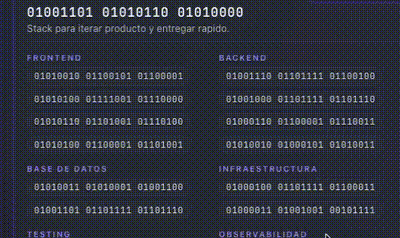

# van-decode-text

> React component that decodes binary text with a hacker-terminal scramble effect.

<p align="center">
  
  
  
  
  
  
</p>

<p align="center">
  <a href="https://ko-fi.com/vanp">
    
  </a>
</p>

## Demo



## What it does

Shows text as binary (`01010010 01100101`) and when triggered, scrambles through random characters before settling on the final text — like a hacker terminal decoding a message.

```
Idle:     01010010 01100101 01100011
Scramble: 0101001$ 0110@1%1 R#$0110
Decoded:  React
```

## Install

```bash
npm install van-decode-text
```

## Usage

```tsx
import { useState } from "react";
import { DecodedText } from "van-decode-text";

function SkillChip() {
  const [isActive, setIsActive] = useState(false);

  return (
    <button onClick={() => setIsActive(!isActive)}>
      <DecodedText isDecoded={isActive}>
        TypeScript
      </DecodedText>
    </button>
  );
}
```

## Props

| Prop | Type | Default | Description |
|------|------|---------|-------------|
| `children` | `string` | — | **Required.** The final text to reveal. |
| `isDecoded` | `boolean` | — | **Required.** Triggers the decode animation. |
| `binaryText` | `string` | auto-generated | Custom binary text for idle state. |
| `reducedMotion` | `boolean` | `false` | Skips animation, shows text immediately. |
| `duration` | `number` | `252` | Total animation duration in ms. |
| `characterSet` | `string` | `01ABCDEF…#$%&*` | Characters used during scramble. |
| `binaryClassName` | `string` | `"decode-text-binary"` | CSS class for binary element. |
| `revealClassName` | `string` | `"decode-text-reveal"` | CSS class for revealed element. |
| `maxBinaryChars` | `number` | `4` | Max chars used to generate binary glyph. |
| `onDecodeComplete` | `() => void` | — | Fires when animation finishes. |

## Utility

```tsx
import { toBinaryGlyph } from "van-decode-text";

toBinaryGlyph("React"); // "01010010 01100101 01100011"
toBinaryGlyph("Hi", 2); // "01001000 01101001"
```

## CSS

The component uses class transitions. Add these to your styles:

```css
.decode-text-binary--hidden {
  display: none;
}

.decode-text-reveal--visible {
  /* your reveal styles */
}
```

Or use Tailwind:

```tsx
<DecodedText
  isDecoded={isActive}
  binaryClassName="opacity-100 data-[hidden]:opacity-0"
  revealClassName="opacity-0 data-[visible]:opacity-100"
>
  React
</DecodedText>
```

## `prefers-reduced-motion`

Pass `reducedMotion={true}` (or detect it yourself) to skip the scramble entirely and show text immediately.

## License

MIT © Vanessa Pellegrini
